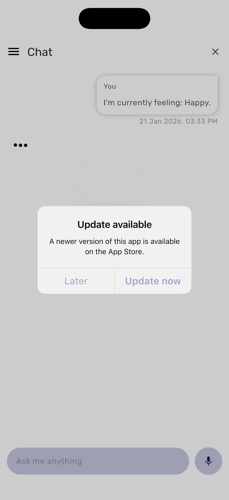

<!--
This README describes the package. If you publish this package to pub.dev,
this README's contents appear on the landing page for your package.

For information about how to write a good package README, see the guide for
[writing package pages](https://dart.dev/tools/pub/writing-package-pages).

For general information about developing packages, see the Dart guide for
[creating packages](https://dart.dev/guides/libraries/create-packages)
and the Flutter guide for
[developing packages and plugins](https://flutter.dev/to/develop-packages).
-->

# in_app_version_update

A lightweight Flutter helper to detect and run app updates on Android (Play In‑App Update) and to present an iOS App Store update dialog.

This package wraps platform-specific update flows and provides a compact, testable API so host apps don't need to depend on `in_app_update` or implement App Store lookups themselves.




Key capabilities

- Android
  - Immediate updates (blocking) using Google Play In‑App Update.
  - Flexible updates (download in background) with a choice of auto-completion or host-controlled completion.
  - Exposes install status updates (stream + optional callback) so host apps can show progress UI and decide when to call `completeFlexibleUpdate()`.
- iOS
  - App Store lookup by app id and an optional, testable Cupertino update dialog.
  - All dialog texts are configurable via parameters so host apps can localize or customize wording.
  - `iosAppId` is optional — if your app only targets Android you can omit it. When iOS flows are used the id must be provided.
- Platform control
    - `checkForUpdate` accepts `checkAndroid` and `checkIos` flags so host apps can selectively run platform checks; both default to `true`.

The repository includes an `example/` app demonstrating immediate and flexible flows, stream and callback usage, auto completion, and iOS dialog usage. Unit tests cover version comparison and mapping logic; widget tests verify the iOS dialog and example screens.

Why use this package

- Single cross-platform API (`InAppVersionUpdate`) for app update flows.
- Keeps host apps decoupled from `in_app_update` and App Store lookup details.
- Stream/callback visibility into install state for better UX (progress, prompts, manual completion).
- Testable helpers (presenting dialog UI without network calls) to simplify unit and widget tests.

## Quick start

1. Add the package to your `pubspec.yaml` (when published use a version; for local development the example imports the library directly):

```yaml
dependencies:
  in_app_version_update: ^<latest-version>
```

2. Create an instance and check for updates:

```dart
Future<void> exampleCheck(BuildContext context) async {
  final updater = InAppVersionUpdate(iosAppId: '123456789');
  await updater.checkForUpdate(context);
}
```

3. Example: Android flexible update with host-controlled completion (listen to stream):

```dart
Future<void> flexibleExample(BuildContext context) async {
  final updater = InAppVersionUpdate(iosAppId: '123456789');

  await updater.checkForUpdate(
    context,
    androidUpdateType: AndroidUpdateType.flexible,
    autoCompleteFlexible: false,
  );

  final sub = updater.installUpdateStream.listen((status) async {
    if (status == InstallStatus.downloaded) {
      // show prompt to user and then call to install
      await updater.completeFlexibleUpdate();
    }
  });

  // Cancel subscription when no longer needed
  await sub.cancel();
}
```

4. Example: Provide a callback to receive install updates (helper keeps an internal subscription you can stop):

```dart
Future<void> callbackExample(BuildContext context) async {
  final updater = InAppVersionUpdate(iosAppId: '123456789');

  await updater.checkForUpdate(
    context,
    androidUpdateType: AndroidUpdateType.flexible,
    autoCompleteFlexible: false,
    onInstallStatus: (status) async {
      if (status == InstallStatus.downloaded) {
        // prompt user and then complete
        await updater.completeFlexibleUpdate();
        await updater.stopInstallStatusCallback();
      }
    },
  );
}
```

5. iOS: present a configurable dialog (host can customize all texts). The helper also provides `presentIosUpdateDialog()` to show dialog UI directly (useful for widget tests):

```dart
Future<void> presentIosDialogExample(BuildContext context) async {
  final updater = InAppVersionUpdate(iosAppId: '123456789');

  await updater.presentIosUpdateDialog(
    context,
    title: 'Update available',
    content: 'A new version is available on the App Store.',
    laterText: 'Not now',
    updateNowText: 'Open App Store',
    onUpdatePressed: () {
      // optional test hook instead of launching the App Store
    },
  );
}
```

## API reference

- Constructor
    - `InAppVersionUpdate({ String? iosAppId, Duration httpTimeout = const Duration(seconds: 10) })`
        - `iosAppId`: Optional numeric App Store id used for iOS lookups. Omit when you only need Android.
        - `httpTimeout`: network timeout for App Store lookup requests.

- checkForUpdate
    - `Future<void> checkForUpdate(BuildContext context, { AndroidUpdateType androidUpdateType = AndroidUpdateType.immediate, bool autoCompleteFlexible = true, void Function(InstallStatus)? onInstallStatus, String iosDialogTitle = 'Update available', String iosDialogContent = 'A newer version of this app is available on the App Store.', String iosLaterButtonText = 'Later', String iosUpdateNowButtonText = 'Update now', bool checkAndroid = true, bool checkIos = true })`
        - `androidUpdateType`: choose `AndroidUpdateType.immediate` or `.flexible`.
        - `autoCompleteFlexible`: When `true` the helper automatically calls `completeFlexibleUpdate()` once a flexible update has been downloaded. If `false`, the host app must call `completeFlexibleUpdate()` when appropriate.
        - `onInstallStatus`: Optional callback that receives mapped `InstallStatus` values during flexible update lifecycle. If used, the helper keeps an internal subscription until `stopInstallStatusCallback()` is called.
        - `iosDialogTitle`, `iosDialogContent`, `iosLaterButtonText`, `iosUpdateNowButtonText`: All dialog texts are configurable; they default to sensible values.
        - `checkAndroid`, `checkIos`: Per-platform boolean flags (both default to `true`). Use these to skip checks on a platform.

- installUpdateStream
    - `Stream<InstallStatus> get installUpdateStream`
        - Emits mapped `InstallStatus` values (enum documented below). Use this when you want host-controlled completion and progress UI.

- completeFlexibleUpdate
    - `Future<void> completeFlexibleUpdate()` — calls Play's API to install a downloaded flexible update.

- stopInstallStatusCallback
    - `Future<void> stopInstallStatusCallback()` — cancels the internal subscription when `onInstallStatus` was provided.

- presentIosUpdateDialog
    - `Future<void> presentIosUpdateDialog(BuildContext context, { String title = 'Update available', String content = 'A newer version of this app is available on the App Store.', String laterText = 'Later', String updateNowText = 'Update now', VoidCallback? onUpdatePressed })`
        - Presents the iOS update dialog UI immediately (no network checks). Useful for widget tests or when the host app wants to control the Update action. If `iosAppId` is not provided and `onUpdatePressed` is `null` the method will log a debug message and return without showing the dialog.

Enums

- `AndroidUpdateType { immediate, flexible }`
- `InstallStatus { unknown, pending, downloading, downloaded, installing, installed, failed, canceled }`

## Testing

- Unit tests
  - Version comparison logic (`isStoreVersionNewer`) and mapping from `in_app_update` statuses to the package `InstallStatus` are covered by unit tests. Edge cases include different segment lengths ("1.2" vs "1.2.0"), pre-release suffixes, and invalid inputs.

- Widget tests
  - iOS dialog UI is tested via `presentIosUpdateDialog` to avoid network calls.
  - Example screens in `example/` are covered by widget tests to verify the UI and that flows present the expected controls.

Run tests:

```bash
flutter test
```

Notes and platform specifics

- Android in-app updates require the Play Store and a real device for full flow validation. Tests intentionally avoid running Play Core flows and instead validate mapping and UI.
- iOS App Store lookup uses a network request to Apple's public lookup API; use a short timeout and handle network failures gracefully in your app.

## License

This project is provided under the terms of the LICENSE file in the repository.

## Acknowledgements

This package uses the `in_app_update` package for Android in-app update integration: https://pub.dev/packages/in_app_update

Many thanks to the author(s) and maintainers of `in_app_update` for their excellent work — this project builds on top of their efforts.

---
